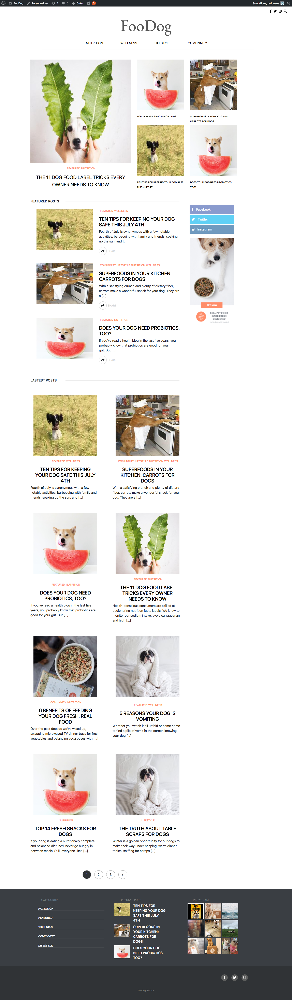
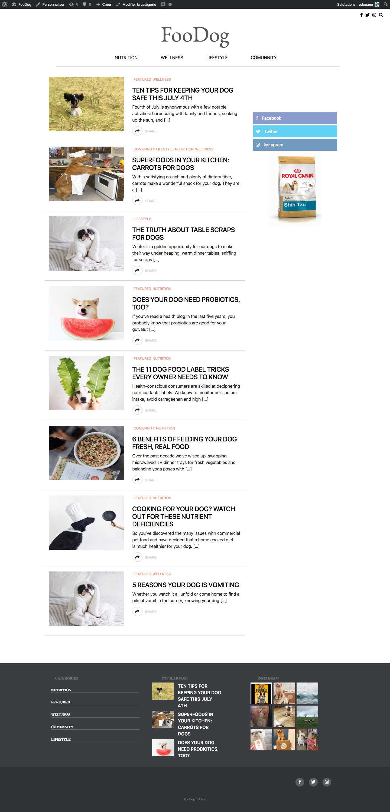
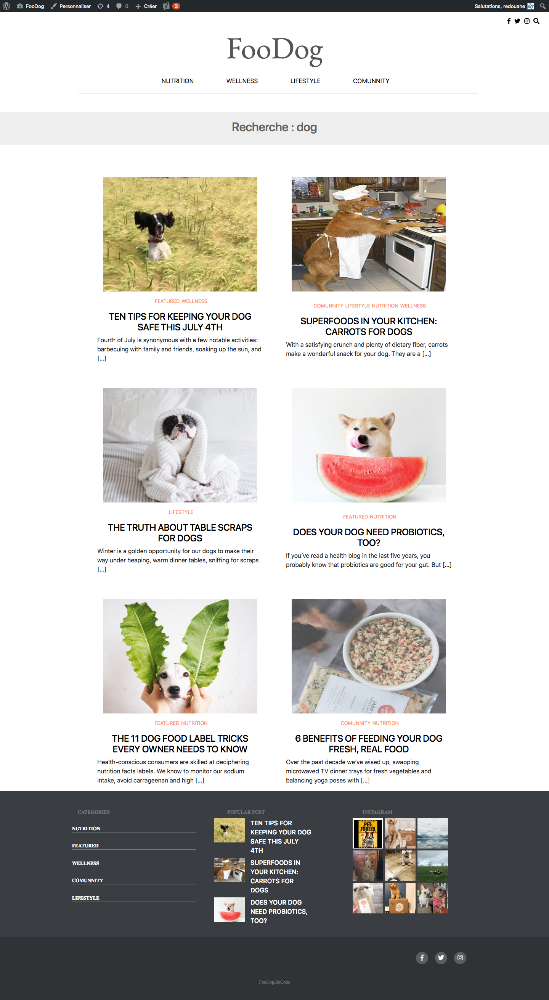

# FooDog-WP

Maxime Huet: La tâche que j'avais à éffectuer était le footer.
             J'ai commencé par faire les couleur fonds et les réseaux sociaux,
             Ensuite j'ai fais un menu pour mes catégories.
             Une boucle à été créer pour générer mes articles populaires.
             Et j'ai terminer avec le widget pour instagram. 
             
Maxime Christiaens : Category.php & _category.css

Valentin Beaufays: Header.php & _header.scss

Boukamir Redouane : functions.php,index.php, loop-sticky.php, loop-views.php, loop.php, search.php, single.php.
_loop-views.scss, _loop.scss, _search.scss, _single.scss, _stickyPost.scss, style.scss.
Afficher et masquer le searchForm en JS.

# Image D'acceuil
------------------

# Image De categorie
------------------

# Image De Search
------------------
